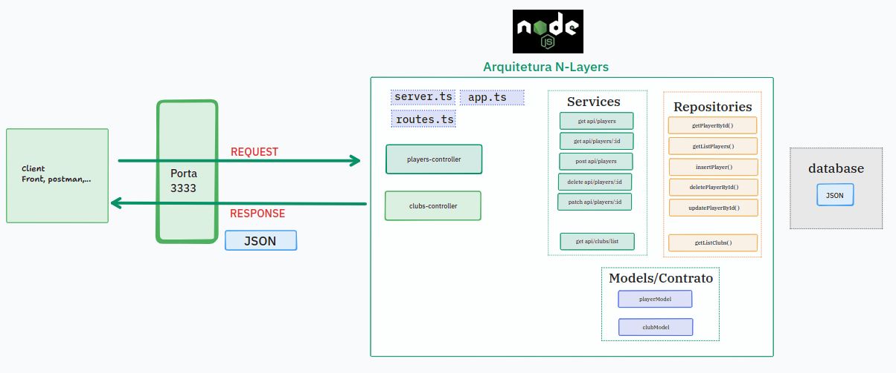

# API Champions League

Uma API REST para gerenciamento de clubes e jogadores, com endpoints para listagem de clubes e CRUD de jogadores (incluindo atualização de estatísticas).

## Funcionalidades

- Listagem de clubes (lidos de arquivo JSON)
- Listagem de jogadores
- Busca de jogador por ID
- Cadastro de jogador
- Remoção de jogador
- Atualização das estatísticas de um jogador

## Tecnologias

- Node.js
- TypeScript
- Express
- CORS
- tsx (execução em desenvolvimento)
- tsup (build)

## Instalação

```bash
# Clone o repositório
git clone https://github.com/ItamarJuniorDEV/api-champions-league-node-express.git

# Entre na pasta do projeto
cd api-champions-league-node-express

# Instale as dependências
npm install

# (Opcional) Ajuste a porta no .env
# PORT=3333

# Inicie o servidor (dev)
npm run dev
````

## Documentação da API

### Arquitetura




## Endpoints

> As rotas são expostas com o prefixo `/api`.

| Recurso | Método   | Endpoint           | Descrição                           |
| ------- | -------- | ------------------ | ----------------------------------- |
| Clubs   | `GET`    | `/api/clubs`       | Lista todos os clubes               |
| Players | `GET`    | `/api/players`     | Lista todos os jogadores            |
| Players | `GET`    | `/api/players/:id` | Busca um jogador por ID             |
| Players | `POST`   | `/api/players`     | Cadastra um novo jogador            |
| Players | `PATCH`  | `/api/players/:id` | Atualiza as estatísticas do jogador |
| Players | `DELETE` | `/api/players/:id` | Remove um jogador                   |

## Licença

Este projeto está licenciado sob a licença ISC.

## Autor

Itamar Junior

```
```
